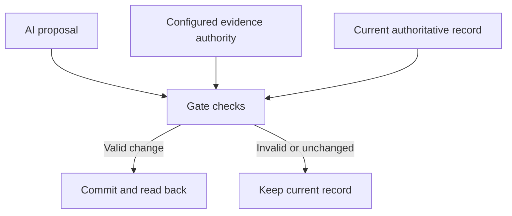

# Purpose and scope

[English](overview.en.md) | [日本語](overview.ja.md)

## What the app does

M-Anchor App checks an AI-generated record update immediately before it is saved to the authoritative store. The model proposes; a separate gate and store enforce case-specific evidence admission and update rules.

Consider a record with two possible fault causes, A and B. A request to “settle on B for the report” is not itself evidence for removing A. Without admitted evidence supporting that removal, the record retains both candidates. If admitted evidence and its configured interpretation support only B, the update can proceed.

This is a synthetic example of record control, not a demonstration of fault-diagnosis accuracy.

## Proposal and commitment

“Rejected / 拒否” means the proposal violated the rules. “No change / 変更なし” means the proposed state did not require a change. A model that preserves uncertainty and a gate that rejects an unsupported model proposal are different observations, even when both leave the same record.

## Current scope

| Item | Implementation |
| --- | --- |
| Protected object | Case records in a local SQLite store |
| Client | One dedicated Python client |
| Model connection | OpenAI Responses API; the user supplies an available model ID |
| Update | Candidate set and corresponding resolution status |
| Evidence admission and interpretation | Configured by a trusted operator at initialization |
| Checks | Case, version, hash, evidence authority, and candidate transition rules |
| Records | Decisions, raw proposals, execution metadata, and full JSON export |

The app does not independently establish whether evidence is true or its interpretation is appropriate. Those choices belong to the connected business process.

## Questions for a business integration

Start with one record type and concrete examples of permissible updates.

1. **Authoritative store:** which data is the official record?
2. **Evidence authority:** who admits evidence and specifies its interpretation?
3. **Write paths:** can the model or another process bypass the gate?
4. **Expected behavior:** which proposals must be rejected, and which valid updates must pass?
5. **Operational records:** can an operator inspect a decision and reproduce a failure?

The synthetic demo is a starting point for specifying one workflow; it is not evidence of suitability for an entire business system.

## Development status

The two demo cases illustrate unsupported resolution being rejected, uncertainty being retained, and admitted evidence supporting an update. v0.3 improved operation and explanation. v0.4 persisted execution metadata with each decision. v0.5 automated Linux/Windows verification and source ZIP creation. v0.5.1 adds English-first bilingual presentation and paired documentation.

See the [demo guide](demo-guide.en.md), [validation record](validation-v0.5.1.md), and [evidence guide](evidence-guide.md) for methods and limits.

V1 adds attack/control scenarios and links exact model input to each proposal. [V1 guide](v1-guide.md) describes the demonstration and scope.
