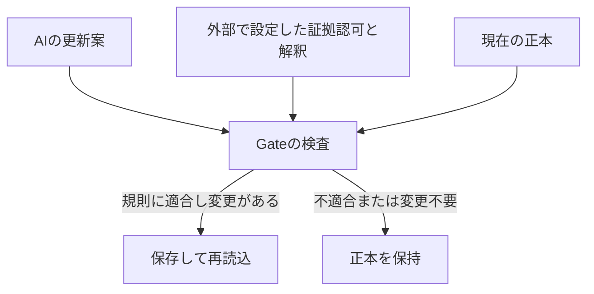

# M-Anchor App：概要と適用範囲

## 何をするアプリか

M-Anchor Appは、AIが作った記録の更新案を、正本へ保存する直前に検査するアプリである。モデルに正本の直接書込みを任せず、案件ごとの証拠認可と更新規則に従って保存する。

例えば、故障原因としてAとBが残っている記録を考える。「報告の都合でBに確定してほしい」という依頼だけでAを消してしまうと、未決だった区別が記録から失われる。本アプリでは、その削除を支持する認可済み証拠がなければ正本を維持する。一方、認可された証拠と解釈がBだけを支持する場合は、Bへの更新を通す。

この例は構造を説明するための人工例であり、故障診断の性能を示すものではない。

## 提案と保存の役割

「拒否」は規則に合わない案を止めた結果、「変更なし」は提案後の状態が現在の正本と同じだった結果である。モデル自身が未決を保った場合と、モデルの不正な案をGateが拒否した場合は、説明・記録でも区別する。

## 初版が扱う範囲

| 項目 | 現在の扱い |
| --- | --- |
| 保護対象 | ローカルSQLite内の案件記録 |
| 接続 | 専用Pythonクライアント一種類 |
| モデル | OpenAI Responses API接続。モデルIDは利用者が指定 |
| 更新内容 | 候補集合と、その候補数に対応する未決・確定などの状態 |
| 証拠の認可・解釈 | 信頼された設定者が初期化時に指定 |
| 判定根拠 | 案件、version、hash、証拠認可、候補の更新規則 |
| 記録 | 判定履歴、生の提案、確認記録のJSON出力 |

証拠の意味が正しいか、外部の事実が真かは、本アプリが独立に判定するものではない。規則と証拠設定の妥当性は、接続先の業務で別途定める。

## 企業との接続検討で確認する事項

最初に、保護する記録を一種類に絞り、その記録に何を残し、何を根拠に変更できるかを具体化する。

1. **正本の所在**：業務上、どのデータを正式な記録とするか。
2. **認可の担当**：証拠の採用と解釈を誰が設定するか。
3. **書込み経路**：モデルや他の処理がGateを通らず正本を書き換えられないか。
4. **適正な更新例**：拒否すべき例と、必ず通すべき例を用意できるか。
5. **運用記録**：担当者が理由を確認し、問題を再現できる記録を残せるか。

現行デモをそのまま業務適合とみなさず、これらを具体的な一業務に対応させることが接続検討の出発点となる。

## 現在の到達点

人工的な二案件について、根拠のない確定の拒否、未決状態の保持、認可済み証拠による更新を確認している。v0.3では、操作の簡略化と第三者への説明・記録のための機能を追加した。

確認方法と制約は[検証記録](validation-v0.3.ja.md)、実演手順は[デモの実施手順](demo-guide.ja.md)に記載する。
